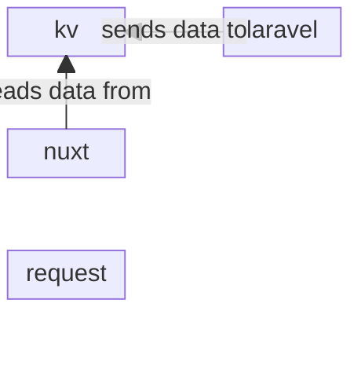

---
---
<NovaMantis></NovaMantis>
# putting it together

draw this out on paper and then create into a diagram

```mermaid {scale: 1, alt: 'putting it all together'}
block-beta
columns 8
    kv:3
    space:2
    laravel:3

    space:8

    nuxt:3
    space:5

    space:8

    request:3
    space:8

    laravel -- "sends data to" --> kv
    nuxt -- "reads data from" --> kv


```
